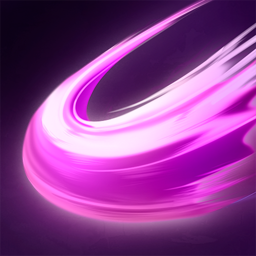
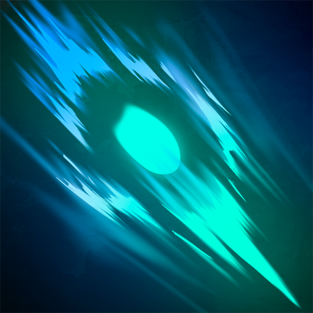
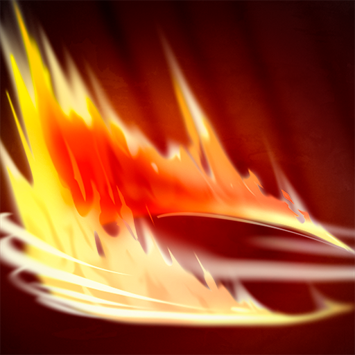
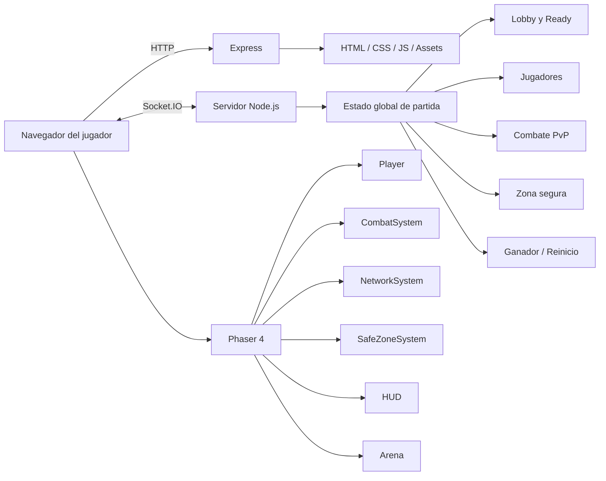

<div align="center">

# ⚔️ AnderCode Battle Royale

### Battle Royale 2D multijugador en tiempo real para navegador

**Entra al lobby · Prepárate · Domina la zona · Sé el último en pie**

<br>


&nbsp;&nbsp;

&nbsp;&nbsp;


<br><br>


<br>

[🌐 Web de Anderson Bastidas](https://anderson-bastidas.com/) ·
[💻 GitHub](https://github.com/Anders87x)

</div>

---

## 🎮 Sobre el proyecto

**AnderCode Battle Royale** es un videojuego 2D multijugador construido para ejecutarse directamente en el navegador.

El objetivo es sencillo: varios jugadores entran al mismo lobby, marcan que están listos, son enviados a una arena PvP y luchan hasta que solamente queda un sobreviviente. Mientras la partida avanza, una **zona segura dinámica** se reduce por fases y obliga a los jugadores a moverse, combatir y tomar decisiones rápidamente.

El proyecto está siendo desarrollado como una experiencia práctica de programación y desarrollo de videojuegos, integrando frontend, networking en tiempo real, físicas, animaciones, lógica de servidor, diseño de interfaz y sistemas de gameplay.

> **Estado actual:** Alpha jugable. El proyecto sigue en desarrollo y sus sistemas continuarán evolucionando.

---

## ✨ Características actuales

- ⚔️ Combate PvP multijugador en tiempo real.
- 🧑 Nombre personalizado para cada jugador.
- 🏠 Lobby previo a la batalla.
- ✅ Sistema de jugadores listos con la tecla **R**.
- ⏱️ Cuenta regresiva automática cuando todos están preparados.
- ❤️ Sistema de vida de **100 HP**.
- 💥 Tres habilidades con daño y cooldown independientes.
- 🌀 Zona segura con **3 fases** de cierre.
- 🛡️ Protección inicial antes de recibir daño por zona.
- ☠️ Eliminación permanente durante la ronda.
- 📰 Kill Feed para eliminaciones por jugador o por zona.
- 👁️ Modo espectador después de morir.
- 🔁 Cambio de jugador observado mediante **TAB**.
- 🏆 Detección automática del último jugador vivo.
- 🔄 Regreso automático al lobby después de terminar la partida.
- 🌲 Arena temática de las **Tierras de los No Muertos**.
- 🪨 Obstáculos con colisiones: árboles, rocas, ruinas, cristales, calaveras y otros elementos.
- ☣️ Lagunas tóxicas y zonas rocosas construidas con tiles del escenario.
- 🎨 Landing page previa al juego.
- 🕹️ Interfaz web estilo cliente de videojuego.
- ⛶ Modo pantalla completa.
- ⌨️ Panel integrado de ayuda y controles.
- 📱 Interfaz web adaptable a diferentes tamaños de pantalla.
- 🌐 Compatible con túneles como **ngrok** para pruebas públicas.

---

## 🕹️ Controles

| Acción | Control |
|---|---|
| Mover arriba | **W** o **↑** |
| Mover abajo | **S** o **↓** |
| Mover izquierda | **A** o **←** |
| Mover derecha | **D** o **→** |
| Ataque normal | **Click izquierdo** o **SPACE** |
| Embestida | **Q** |
| Giro 360° | **E** |
| Marcar LISTO en lobby | **R** |
| Cambiar jugador al espectar | **TAB** |

El movimiento diagonal se normaliza para evitar que desplazarse en diagonal sea más rápido que hacerlo en línea recta.

---

## ⚔️ Habilidades

<table>
  <tr>
    <th align="center">Habilidad</th>
    <th align="center">Control</th>
    <th align="center">Daño</th>
    <th align="center">Cooldown</th>
    <th>Descripción</th>
  </tr>
  <tr>
    <td align="center">
      <br>
      <strong>Ataque normal</strong>
    </td>
    <td align="center"><strong>LMB / SPACE</strong></td>
    <td align="center"><strong>25</strong></td>
    <td align="center"><strong>0.8 s</strong></td>
    <td>Golpe frontal rápido para presionar y rematar enemigos cercanos.</td>
  </tr>
  <tr>
    <td align="center">
      <br>
      <strong>Embestida</strong>
    </td>
    <td align="center"><strong>Q</strong></td>
    <td align="center"><strong>35</strong></td>
    <td align="center"><strong>4 s</strong></td>
    <td>Desplazamiento ofensivo de alta velocidad para cerrar distancia y golpear.</td>
  </tr>
  <tr>
    <td align="center">
      <br>
      <strong>Giro 360°</strong>
    </td>
    <td align="center"><strong>E</strong></td>
    <td align="center"><strong>30</strong></td>
    <td align="center"><strong>7 s</strong></td>
    <td>Ataque de área alrededor del personaje para castigar rivales demasiado próximos.</td>
  </tr>
</table>

El cliente muestra visualmente el cooldown de cada habilidad mediante el HUD. El servidor también valida los tiempos de reutilización para evitar ataques enviados fuera de tiempo.

---

## 🌀 Sistema de zona segura

La arena utiliza una zona circular que se va reduciendo por fases.

Al comenzar la partida hay **15 segundos de protección inicial**, lo que permite a los jugadores posicionarse antes de que estar fuera del círculo empiece a causar daño.

| Fase | Radio | Espera | Cierre | Daño fuera de zona |
|---|---:|---:|---:|---:|
| **1** | 620 → 440 | 15 s | 18 s | 2 HP/s |
| **2** | 440 → 280 | 8 s | 16 s | 4 HP/s |
| **3** | 280 → 120 | 6 s | 14 s | 7 HP/s |

El cálculo de la zona y su daño se ejecuta en el servidor. El cliente recibe el estado necesario para dibujar el círculo y mostrar información de fase y tiempo restante.

---

## 🏆 Ciclo de una partida

```text
Landing Page
     │
     ▼
Ingresar nombre
     │
     ▼
Lobby multijugador
     │
     ├── R = LISTO
     │
     ▼
Todos los jugadores listos
     │
     ▼
Countdown 3 segundos
     │
     ▼
Arena Battle Royale
     │
     ├── PvP
     ├── Zona por fases
     ├── Kill Feed
     └── Eliminaciones
     │
     ▼
Último jugador vivo
     │
     ▼
Victoria / resultado
     │
     ▼
5 segundos
     │
     ▼
Regreso automático al lobby
```

Si un jugador entra cuando una partida ya está en progreso, se incorpora inicialmente como espectador y espera a la siguiente ronda.

---

## 👁️ Modo espectador

Cuando el jugador local es eliminado durante una partida:

1. deja de controlar su personaje;
2. la cámara pasa a seguir a un jugador que siga vivo;
3. se muestra el nombre del jugador observado;
4. con **TAB** se puede alternar entre los sobrevivientes;
5. al regresar al lobby la cámara vuelve al personaje local.

Esto permite seguir viendo la partida en lugar de quedarse observando el cuerpo eliminado.

---

## 🌎 Arena: Tierras de los No Muertos

La arena actual utiliza una estética de mundo undead con pixel art.

Incluye:

- terreno y caminos construidos por capas;
- árboles muertos;
- troncos;
- tumbas;
- rocas;
- ruinas;
- cristales;
- plantas;
- espinas;
- montones de calaveras;
- elementos decorativos;
- zonas tóxicas;
- formaciones rocosas;
- colisiones físicas en los principales obstáculos.

Los assets de producción utilizados por el juego se encuentran principalmente en:

```text
client/assets/arena/undead/
```

Los archivos originales usados como referencia y material de trabajo permanecen dentro de:

```text
docs/sprites/
```

De esta manera el código de producción no depende directamente de la carpeta de documentación.

---

## 🧑‍💻 Tecnología utilizada

| Tecnología | Uso |
|---|---|
| **Phaser 4.2.1** | Motor del juego, renderizado, sprites, animaciones, cámara, input y Arcade Physics |
| **JavaScript ES Modules** | Arquitectura modular del cliente |
| **Node.js** | Runtime del servidor |
| **Express 5.2.1** | Servidor HTTP y entrega de archivos estáticos |
| **Socket.IO 4.8.1** | Comunicación multijugador bidireccional en tiempo real |
| **HTML5** | Estructura de landing e interfaz externa al canvas |
| **CSS3** | Diseño responsive, HUD web, animaciones y experiencia visual |
| **Tiled / TMX** | Referencia para composición del tileset del mapa |
| **ngrok** | Exposición temporal del servidor local para pruebas externas |

El proyecto actualmente **no necesita Vite, Webpack ni un proceso de build frontend**. Phaser se carga desde CDN y el cliente se sirve directamente mediante Express.

---

## 🏗️ Arquitectura general



### Responsabilidades del cliente

El navegador controla principalmente:

- input del jugador;
- animaciones;
- renderizado;
- cámara;
- efectos visuales;
- HUD;
- interpolación de jugadores remotos;
- presentación de la zona;
- landing y experiencia de interfaz.

### Responsabilidades del servidor

Node.js mantiene principalmente:

- conexiones;
- nombres de jugadores;
- estado del lobby;
- ready / countdown;
- estado global de la partida;
- vida;
- muertes;
- kills;
- cooldowns de ataques;
- comprobación de impacto PvP;
- zona segura;
- daño por zona;
- ganador;
- retorno al lobby.

> Actualmente el movimiento se sincroniza desde el cliente y se limita a los bounds del mundo desde el servidor. Un sistema anti-cheat completamente autoritativo para movimiento forma parte de las mejoras futuras.

---

## 📡 Eventos principales de Socket.IO

La comunicación utiliza eventos específicos para cada parte del gameplay.

| Evento | Propósito |
|---|---|
| `player:register` | Registrar o actualizar el nombre del jugador |
| `player:registered` | Confirmación del registro |
| `players:sync` | Solicitar sincronización del estado |
| `players:init` | Recibir jugadores existentes |
| `players:self` | Estado autoritativo inicial del jugador local |
| `player:joined` | Nuevo jugador conectado |
| `player:left` | Jugador desconectado |
| `player:name` | Cambio/sincronización de nombre |
| `player:state` | Movimiento, dirección y estado visual |
| `player:attack` | Solicitud/transmisión de ataque |
| `player:damaged` | Daño recibido por el jugador local |
| `player:health` | Actualización pública de vida |
| `player:hit-confirm` | Confirmación de impacto |
| `players:count` | Número de jugadores conectados |
| `match:ready` | Alternar estado LISTO |
| `match:ready-ack` | Confirmación del ready |
| `match:state` | Estado completo de la partida |
| `match:players-reset` | Reposicionamiento para arena/lobby |
| `match:kill` | Evento para el kill feed |

---

## 🧩 Estructura del proyecto

```text
batle_royale_andercode/
│
├── client/
│   ├── index.html
│   │
│   ├── css/
│   │   └── styles.css
│   │
│   ├── assets/
│   │   ├── arena/
│   │   │   └── undead/
│   │   ├── characters/
│   │   │   └── swordsman/
│   │   │       ├── idle.png
│   │   │       ├── walk.png
│   │   │       ├── attack.png
│   │   │       ├── hurt.png
│   │   │       └── death.png
│   │   ├── effects/
│   │   │   ├── attack1/
│   │   │   ├── attack2/
│   │   │   └── attack3/
│   │   └── ui/
│   │       └── abilities/
│   │
│   └── js/
│       ├── main.js
│       ├── animations/
│       │   └── swordsmanAnimations.js
│       ├── config/
│       │   └── game-config.js
│       ├── entities/
│       │   ├── Player.js
│       │   ├── RemotePlayer.js
│       │   ├── TrainingDummy.js
│       │   └── TrainingEnemy.js
│       ├── scenes/
│       │   └── GameScene.js
│       ├── systems/
│       │   ├── CollisionSystem.js
│       │   ├── CombatEffectSystem.js
│       │   ├── CombatSystem.js
│       │   ├── NetworkSystem.js
│       │   ├── SafeZoneSystem.js
│       │   └── SpectatorSystem.js
│       ├── ui/
│       │   ├── AbilityHud.js
│       │   ├── KillFeed.js
│       │   ├── MatchHud.js
│       │   └── PlayerHud.js
│       └── world/
│           ├── ArenaEnvironment.js
│           └── LobbyEnvironment.js
│
├── server/
│   └── index.js
│
├── docs/
│   └── sprites/
│
├── package.json
├── package-lock.json
└── README.md
```

> `TrainingDummy.js` y `TrainingEnemy.js` se conservan como código histórico/de pruebas, pero actualmente los maniquíes no se cargan en el lobby.

---

## 🧠 Sistemas principales del cliente

### `Player.js`

Administra el personaje local:

- WASD y flechas;
- dirección;
- velocidad;
- animaciones;
- vida;
- hurt;
- muerte;
- respawn;
- acciones forzadas como la embestida.

### `CombatSystem.js`

Controla:

- ataques;
- cooldowns;
- buffer de input;
- activación de habilidades;
- comunicación con efectos;
- emisión de ataques hacia networking.

### `CombatEffectSystem.js`

Gestiona los efectos visuales de las tres habilidades y sus animaciones.

### `NetworkSystem.js`

Es el puente entre Phaser y Socket.IO:

- conexión;
- registro;
- sincronización;
- jugadores remotos;
- match state;
- ready;
- daño;
- kills;
- safe zone;
- espectador.

### `SafeZoneSystem.js`

Dibuja y actualiza el círculo seguro de acuerdo con los tiempos enviados por el servidor.

### `SpectatorSystem.js`

Permite que los jugadores eliminados observen a quienes siguen vivos.

### `CollisionSystem.js`

Centraliza las colisiones físicas entre el jugador local, jugadores remotos y obstáculos del escenario.

---

## 🎞️ Animaciones del personaje

El personaje principal utiliza spritesheets de **64×64 px por frame**.

| Animación | Frames por dirección |
|---|---:|
| Idle frontal / izquierda / derecha | 12 |
| Idle superior | 4 |
| Caminar | 6 |
| Ataque | 8 |
| Recibir daño | 5 |
| Muerte | 7 |

Direcciones:

```text
0 = abajo / frontal
1 = izquierda
2 = derecha
3 = arriba / espalda
```

---

## 📐 Dimensiones principales

| Elemento | Valor |
|---|---:|
| Resolución lógica del juego | 960 × 540 |
| Mundo completo | 3200 × 900 |
| Ancho del lobby | 1440 |
| Inicio de arena X | 1600 |
| Ancho de arena | 1440 |
| Velocidad del jugador | 180 |
| HP máximo | 100 |
| Jugadores mínimos para iniciar | 2 |

Phaser utiliza `FIT` y centrado automático para adaptar la resolución lógica al contenedor web.

---

## 🚀 Instalación local

### Requisitos

Necesitas tener instalado:

- **Node.js**
- **npm**
- **Git**
- un navegador moderno

### 1. Clonar el repositorio

```bash
git clone https://github.com/Anders87x/batle_royale_andercode.git
cd batle_royale_andercode
```

### 2. Usar la rama de desarrollo actual

```bash
git checkout fase-2-hitbox-dano
```

### 3. Instalar dependencias

```bash
npm install
```

### 4. Iniciar el servidor

```bash
npm start
```

El servidor utiliza por defecto:

```text
http://localhost:3000
```

También puedes definir otro puerto mediante la variable de entorno `PORT`.

---

## 🌐 Compartir una partida con ngrok

Con el servidor local activo:

```bash
npm start
```

abre una segunda terminal:

```bash
ngrok http 3000
```

Ngrok mostrará una URL HTTPS similar a:

```text
https://xxxxx.ngrok-free.app
```

Comparte esa URL con los demás jugadores.

Todos los participantes que entren por la misma instancia del servidor compartirán el mismo lobby y estado global de partida.

> Mantén abiertas tanto la terminal de Node.js como la de ngrok durante la prueba.

---

## 🔄 Flujo de desarrollo

Para actualizar tu copia local de la rama actual:

```bash
git checkout fase-2-hitbox-dano
git pull origin fase-2-hitbox-dano
npm start
```

Si no hubo cambios en dependencias no es necesario ejecutar `npm install` nuevamente.

---

## 🔐 Seguridad actual

El servidor ya realiza varias validaciones importantes:

- sanitiza nombres;
- evita nombres duplicados agregando sufijos;
- limita nombres a 16 caracteres;
- mantiene HP y muertes;
- valida cooldowns de ataques;
- calcula impacto de habilidades en servidor;
- calcula daño de zona en servidor;
- limita posiciones a los bounds del lobby o arena;
- ignora determinadas actualizaciones de vida enviadas por cliente durante el combate.

Aun así, el proyecto está en **Alpha**. Antes de considerarlo competitivo o público a gran escala faltan protecciones adicionales, especialmente para validación autoritativa de movimiento, velocidad y detección de comportamiento anómalo.

---

## 🗺️ Roadmap

### Implementado ✅

- Landing page y experiencia de entrada.
- Registro de nombre.
- Lobby multijugador.
- Ready + countdown.
- Arena independiente.
- Movimiento WASD + flechas.
- Ataques y cooldowns.
- Vida, daño y muerte.
- PvP por Socket.IO.
- Kill Feed.
- Ganador.
- Modo espectador.
- Zona segura por fases.
- Protección inicial de zona.
- Escenario undead con colisiones.
- Panel de controles.
- Pantalla completa.
- Interfaz responsive.

### Próximas mejoras posibles 🚧

- Más personajes jugables.
- Animaciones únicas para cada habilidad.
- Selección de personaje.
- Pickups y recuperación de vida.
- Loot dentro de la arena.
- Más mapas.
- Obstáculos y mapas diseñados específicamente para PvP.
- Spawn dinámico según número de jugadores.
- Zona con centro cambiante entre fases.
- Sistema de salas.
- Matchmaking.
- Código de invitación por partida.
- Ranking.
- Estadísticas persistentes.
- Historial de victorias y kills.
- Autenticación.
- Base de datos.
- Anti-cheat de movimiento.
- Validación más estricta del servidor.
- Audio, música y efectos sonoros.
- Menú de configuración.
- Soporte táctil / controles móviles.
- Gamepad.

---

## 🎨 Assets y créditos

Este proyecto utiliza distintos recursos gráficos durante su etapa de desarrollo.

El escenario undead incorporado en la arena está basado en:

**CraftPix — Free Undead Tileset Top-Down Pixel Art**  
https://craftpix.net/freebies/free-undead-tileset-top-down-pixel-art/

Los archivos de referencia se conservan dentro de `docs/sprites/descarga5/` y solamente los recursos seleccionados para producción se copian a `client/assets/`.

Otros sprites, efectos e iconos presentes en `docs/sprites/` se mantienen como material de desarrollo y referencia.

> Los assets de terceros conservan sus respectivas condiciones y licencias originales. La presencia de un recurso dentro de este repositorio no cambia los derechos asociados a su autor original.

---

## 👨‍💻 Autor

<div align="center">

### Anderson Bastidas · AnderCode

Desarrollo de software, proyectos prácticos, cursos y contenido de programación.

🌐 **https://anderson-bastidas.com/**

</div>

---

## ⚠️ Estado del proyecto

AnderCode Battle Royale se encuentra actualmente en una etapa **Alpha / experimental**.

La finalidad actual es continuar construyendo y validando mecánicas de gameplay, multiplayer, experiencia de usuario y arquitectura técnica antes de avanzar hacia sistemas más complejos como persistencia, matchmaking y seguridad competitiva.

Los valores de daño, cooldowns, zona, mapa y balance pueden cambiar durante el desarrollo.

---

<div align="center">

## ⚔️ ¿Listo para entrar a la arena?

```bash
npm install
npm start
```

**Abre http://localhost:3000 y conviértete en el último jugador en pie.**

<br>

Hecho con código, pixel art y muchas pruebas por **AnderCode**.

</div>
